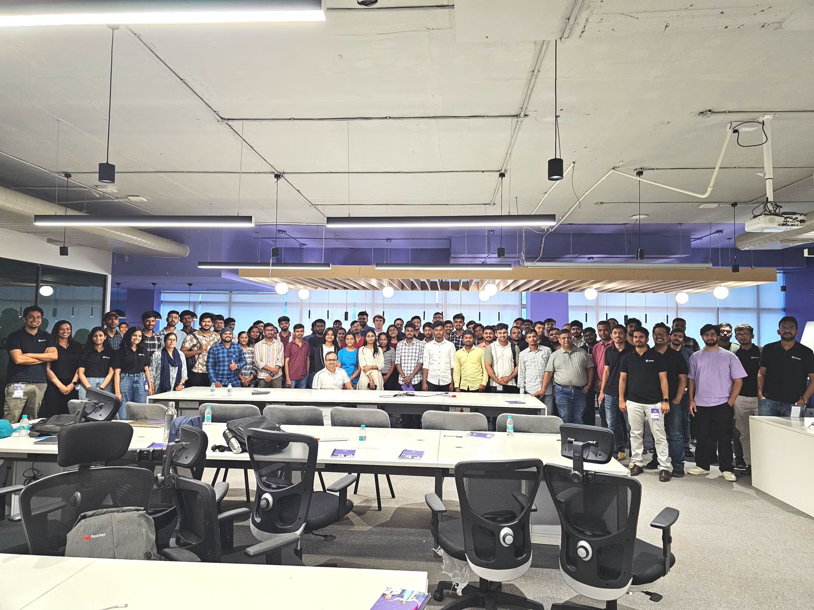

## AI in Web Development: Talks and Resources

Event: [React meetup #88](https://www.meetup.com/reactjs-bangalore/events/306320480/)
Date: 12th April 2025



[My Handwritten Notes](https://github.com/kurtzace/diary-2025/blob/main/seminars/reactmeetup88/react%20meet%20up%2088%20AI%20in%20web%20development%202025-04-12%2021-57.pdf)

A series of presentations centered on artificial intelligence and its applications in web development, particularly within the React ecosystem. Several talks focus on integrating AI tools and SDKs from platforms like Vercel and ElevenLabs to enhance React applications with features like AI-powered search and voice chatbots. Additionally, one presentation addresses the critical topic of AI security vulnerabilities, specifically one-pixel attacks. 

**Details**

Agenda

-   **AI for Web Development** by [Vishwesh Jainkuniya](https://www.linkedin.com/in/jainkuniya/), Lead Engineer, [eka.care](http://eka.care/)
-   **AI for React Developers | A Deep Dive into the Vercel's AI SDK** by [Milind Mishra](https://www.linkedin.com/in/mishramilind/), Product Engineer, Merlin AI
-   **Making React Apps Smarter with Al-Powered Search** by [Ajay Lakshman](https://www.linkedin.com/in/ajay-lakshman-2634a1a3/), Full Stack Developer, FCL Australia
-   **Building a Smart AI Voice Chatbot with React and ElevenLabs AI.** by [Pratik Yadav](https://www.linkedin.com/in/pratikyadavdeveloper/), Software Engineer, Liftoff LLC
-   **Fooling AI: The Hidden Threat of One-Pixel Attacks** by [Khushi Gupta](https://www.linkedin.com/in/khushi-gupta-ba6266247), Cyber Security Engineer

<https://t.co/rUFkFpVrp6>  leverage the powerful AI APIs natively available in Chrome to build AI web products.

[**ai-roadmap-generator**](https://github.com/thatbeautifuldream/ai-roadmap-generator)

[**https://milindmishra.com/slide/ai-for-react-developers**](https://milindmishra.com/slide/ai-for-react-developers)[**https://github.com/thatbeautifuldream/ai-for-react-developers**](https://github.com/thatbeautifuldream/ai-for-react-developers)
        

# The Dawn of AI in Web Development

*   Imagine the power of **AI as JavaScript APIs natively available in Chrome** .
*   **AI is already here**, not just the future of Chrome .
*   Let's build **smarter, faster, and with more fun — right in the browser** .

---

## Vishwesh Jainkuniya: AI for Web Development

*   Lead Engineer at eka.care .
*   Focused on leveraging **AI APIs natively available in Chrome** to build AI web products .
*   **Traditional client-server model evolving** towards browser as the compute engine for AI .
*   **Modern way:** Utilizing browser's compute power .
*   **Key Libraries:** TensorFlow.js, face-api.js, ml5js, kalidokit, Handtrack.js .
*   **Real-world applications** being built directly in the browser .
*   **AI-native extensions** are coming .
*   Examples: **Translate**, **Language Detector**, **Summarizer**, utilizing browser's built-in capabilities .
*   Demonstrated creating a translator with `self.ai.translator.create()` .
*   Discussed the benefits: **Cost**, **Computation**, **Deployment**, **Load**, **Scale**, **Privacy**, **User Experience**, **Offline AI usage** .
*   Highlighted **AI in DevTools** and **Help in write** as future possibilities .
*   **AI won’t replace developers, but developers who use AI will replace those who don’t** .
*   Imagine sites adjusting layout based on client-side AI predictions .


### Code snippets
Here are the markdown code snippets for the translator and summarizer, as mentioned in the context of Vishwesh Jainkuniya's presentation "AI for Web Development":

### Translator
```javascript
const translator2 = await self.ai.translator.create({
  sourceLanguage: 'es',
  targetLanguage: 'hi',
  monitor(m) {
    m.addEventListener('downloadprogress', (e) => {
      console.log(`Downloaded ${e.loaded} of ${e.total} bytes.`);
    });
  },
});

await translator2.translate("Hello, how are you");
```
This snippet demonstrates creating a translator object using `self.ai.translator.create()` with specified source and target languages and then translating text using the `translate()` method. The `monitor` function shows how to track the download progress of the necessary AI model.

### Summarizer
```javascript
const summarizer = await ai.summarizer.create({
  monitor(m) {
    m.addEventListener('downloadprogress', (e) => {
      console.log(`Downloaded ${e.loaded} of ${e.total} bytes.`);
    });
  }
});

const summary = await summarizer.summarize(text, {
  context: 'These are a prescription data intended to be consumed by doctor.',
});
```
This snippet shows how to create a summarizer object using `ai.summarizer.create()` and then summarize text using the `summarize()` method. It also includes an optional `context` parameter to guide the summarization. Similar to the translator, it includes a `monitor` function to track the download progress.

Regarding **face detection using face-api.js** and **image classification using TensorFlow.js**, the sources mention these as **key libraries** for building AI-powered web applications directly in the browser. However, the provided snippets in the sources do not give specific examples of face detection or image classification code using these libraries.

To use **face-api.js** for face detection, you would typically load the necessary models, access the user's camera or load an image, and then use the library's functions to detect faces. Here's a general structure:

```javascript
// Load face detection models
await faceapi.nets.ssdMobilenetv1.loadFromUri('/models');
await faceapi.nets.faceLandmark68Net.loadFromUri('/models');
await faceapi.nets.faceRecognitionNet.loadFromUri('/models');

// Get video stream or image element
const video = document.getElementById('video');
const canvas = document.getElementById('canvas');
const displaySize = { width: video.width, height: video.height };
faceapi.matchDimensions(canvas, displaySize);

// Detect faces in the video stream
video.addEventListener('play', async () => {
  setInterval(async () => {
    const detections = await faceapi.detectAllFaces(video, new faceapi.SsdMobilenetv1Options()).withFaceLandmarks().withFaceDescriptors();
    const resizedDetections = faceapi.resizeResults(detections, displaySize);
    canvas.getContext('2d').clearRect(0, 0, canvas.width, canvas.height);
    faceapi.draw.drawDetections(canvas, resizedDetections);
    faceapi.draw.drawFaceLandmarks(canvas, resizedDetections);
  }, 100);
});
```

For **image classification using TensorFlow.js**, you would typically load a pre-trained model (like MobileNet or Inception), load an image, preprocess it, and then use the model to make a prediction. Here's a general structure:

```javascript
// Load a pre-trained image classification model
const model = await tf.loadLayersModel('https://storage.googleapis.com/tfjs-models/tfjs/mobilenet_v1_1.0_224/model.json');

// Load an image element
const image = document.getElementById('image');

// Preprocess the image
const tensor = tf.browser.fromPixels(image)
  .resizeNearestNeighbor()
  .toFloat()
  .expandDims(0);

const normalizedTensor = tensor.div(255.0);

// Make a prediction
const predictions = await model.predict(normalizedTensor).data();

// Process the predictions
const top5 = Array.from(predictions)
  .map((p, i) => ({
    probability: p,
    className: IMAGENET_CLASSES[i]
  }))
  .sort((a, b) => b.probability - a.probability)
  .slice(0, 5);

console.log('Top 5 predictions:', top5);
```

Please note that these last two code structures are general examples and might require further setup (like including the libraries in your HTML and potentially loading model files). The essential point is that **face-api.js** and **TensorFlow.js** are key libraries enabling these kinds of AI functionalities directly in the web browser.

---

## Milind Mishra: AI for React Developers | A Deep Dive into the Vercel's AI SDK

*   Product Engineer at Merlin AI .
*   Presented a deep dive into **Vercel's AI SDK** .
*   Showcased the **"ai-for-react-developers" project** on GitHub .
*   The project **demonstrates AI integration and best practices for React developers** [8-10].
*   Highlights various **AI-powered features and tools** using the latest web technologies [8-10].
*   **Tech Stack:** Next.js 15.2.4 with React 19, TailwindCSS, Vercel AI SDK, multiple provider SDKs (@ai-sdk/openai, @ai-sdk/google, @ai-sdk/groq), React-specific hooks (@ai-sdk/react) .
*   **Key Features:**
    *   **Multi-Model Support:** OpenAI (GPT-3.5 Turbo, GPT-4, GPT-4 Turbo), Google AI (Gemini Pro, Gemini 1.5 Pro, Gemini Pro Vision), Groq (Llama2-70B, Mixtral-8x7B) .
    *   **Advanced AI Capabilities:** Text Generation, Streaming Responses, Structured Data, Tool Calling (OpenAI), Image Generation (Gemini Pro Vision) .
    *   **Vercel AI SDK Features:** Streaming UI components with React suspense, Type-safe schema validation with Zod, Standardized API interfaces, Edge runtime support .
*   Comprehensive **API Routes** demonstrating different AI capabilities for each provider .
*   Link to slides: [https://milindmishra.com/slide/ai-for-react-developers](https://milindmishra.com/slide/ai-for-react-developers) .
*   Link to GitHub repository: [https://github.com/thatbeautifuldream/ai-for-react-developers](https://github.com/thatbeautifuldream/ai-for-react-developers) .

---

## Ajay Lakshman: Making React Apps Smarter with AI-Powered Search

*   Full Stack Developer at FCL Australia .
*   Discussed the concept of **making React applications smarter with AI-powered search** .
*   Potential technologies mentioned in related context: **Pinecone** as a vector database, leveraging **vector embeddings** for semantic search .
*   The goal is to implement **intent-based search** for a more intelligent user experience .
*   Alternative search technologies like **Chrome's native hierarchical navigable small world (HNSW)** or **IVF (Inverted File Index)** were also noted .

---

## Pratik Yadav: Building a Smart AI Voice Chatbot with React and ElevenLabs AI

*   Software Engineer at Liftoff LLC .
*   Focused on **building smart AI voice chatbots using React and ElevenLabs AI** .
*   **Tech Stack** mentioned in a related context for Smart AI Chatbots included: Auto Speech Recognition (ASR), Natural Language Processing (NLP), Text-to-Speech (TTS), and Machine Learning (ML) for learning from experience .
*   **ElevenLabs AI** is used for the **voice search** capabilities of the chatbot .
*   The architecture involves React components interacting with AI models (like OpenAI or Gemini) and the ElevenLabs SDK for voice output .

---

## Khushi Gupta: Fooling AI: The Hidden Threat of One-Pixel Attacks

*   Cyber Security Engineer .
*   Presented on **"Fooling AI: The Hidden Threat of One-Pixel Attacks"** .
*   Highlighted the **cybersecurity vulnerabilities** associated with AI systems .
*   Discussed techniques like adding **imperceptible noise** to images or training **surrogate models** to fool AI .
*   Mentioned specific attack vectors like **one-pixel attacks** .

---

### General Themes and Discussions

*   The meetup highlighted the growing importance and accessibility of **AI in web development**.
*   Emphasis on leveraging **browser-based AI** for enhanced performance, privacy, and user experience .
*   The **Vercel AI SDK** provides a powerful and streamlined way to integrate various AI capabilities into React applications .
*   AI-powered search and voice interfaces are making web applications smarter and more interactive .
*   It's crucial to be aware of the **security implications** of AI, such as adversarial attacks .
*   The sentiment was that **AI will augment developer capabilities**, not replace them entirely .

---

### Key Takeaways

*   **AI is becoming an integral part of modern web development.**
*   Developers should explore **browser-based AI libraries** and **cloud-based AI SDKs** to enhance their applications.
*   Understanding the **capabilities and limitations of different AI models** is essential.
*   **Security considerations** are paramount when integrating AI into web applications.
*   The future of web development involves a strong synergy between **human developers and AI tools.**

---
---
---


## Pratik Yadav: Building a Smart AI Voice Chatbot with React and ElevenLabs AI

---

### Smart AI Voice Chatbots with React

*   **Pratik Yadav** from **Liftoff LLC** and **GeekyAnts** presented on building smart AI voice chatbots using **React** .
*   The focus was on integrating **voice search** capabilities into React applications .

---

### Key Technologies

*   The tech stack for building such chatbots includes :
    *   **ASR (Auto Speech Recognition)**
    *   **NLP (Natural Language Processing)**: for context and embedding.
    *   **TTS (Text-to-Speech)**
    *   **ML (Machine Learning)**: to learn from experience and accuracy.
*   **ElevenLabs AI** was specifically used for the **voice search** functionality .
*   The chatbot architecture involves :
    *   **React.js** components for the user interface.
    *   Interaction with **AI Models** (e.g., OpenAI, Gemini).
    *   Integration of the **ElevenLabs SDK** for voice output (TTS).
    *   A potential **Backend Service** and **AI app** to manage the AI logic.

---

### Voice Integration

*   **ElevenLabs/React** was mentioned in the context of **TTS (Text-to-Speech)** and providing the **voice systems engine** .
*   The flow likely involves the React app capturing voice input (using ASR), processing it with an AI model (NLP), and then using ElevenLabs AI to generate voice output based on the AI's response .

### Code Snippets
**Example for generating text using OpenAI:**

```javascript
// In a React component or API route
async function generateOpenAIText(prompt) {
  const response = await fetch('/api/openai/generate-text', {
    method: 'POST',
    headers: {
      'Content-Type': 'application/json',
    },
    body: JSON.stringify({ prompt }),
  });

  if (!response.ok) {
    throw new Error(`HTTP error! status: ${response.status}`);
  }

  const data = await response.json();
  return data.output; // Assuming the API returns the generated text in 'output' field
}
```

(`/api/openai/generate-text`) might look conceptually similar to this :

```javascript
// /pages/api/openai/generate-text.ts
import { OpenAIStream, StreamingTextResponse } from 'ai';
import OpenAI from 'openai';

// Initialize OpenAI client (you would need your API key)
const openai = new OpenAI({
  apiKey: process.env.OPENAI_API_KEY,
});

export const runtime = 'edge'; // For Vercel Edge Functions

export default async function handler(req: Request): Promise<Response> {
  const { prompt } = await req.json();

  const response = await openai.chat.completions.create({
    model: 'gpt-3.5-turbo',
    stream: true,
    messages: [
      { role: 'user', content: prompt },
    ],
  });

  // Convert the response into a friendly text-stream
  const stream = OpenAIStream(response);

  // Respond with the stream
  return new StreamingTextResponse(stream);
}
```

A conceptual example of how you might use the ElevenLabs SDK in a React component :

```javascript
// This is a conceptual example and might not reflect the exact ElevenLabs SDK API.
import ElevenLabs from 'elevenlabs'; // Assuming an ElevenLabs SDK import

// You would need to obtain and configure your API key
const elevenLabsClient = new ElevenLabs({ apiKey: 'YOUR_ELEVENLABS_API_KEY' });

async function generateAndPlayVoice(text, voiceId) {
  try {
    const audio = await elevenLabsClient.textToSpeech({
      text: text,
      voice_id: voiceId, // Specify the desired voice
    });

    // Assuming 'audio' is an audio blob or similar
    const audioUrl = URL.createObjectURL(new Blob([audio]));
    const audioElement = new Audio(audioUrl);
    audioElement.play();
  } catch (error) {
    console.error('Error generating voice:', error);
  }
}

// Example usage in a React component
// generateAndPlayVoice("Hello, this is a test.", "YOUR_VOICE_ID");
```


---

## Ajay Lakshman: Making React Apps Smarter with AI-Powered Search

---

### Smarter Search in React Apps

*   **Ajay Lakshman**, a Full Stack Developer at FCL Australia, discussed how to enhance React applications with **AI-powered search** .
*   The core idea is to move beyond keyword-based search to **intent-based search** .

---

### The Challenge: Traditional Search

*   Traditional search relies on matching keywords entered by the user with the content available.
*   It often fails to understand the **user's intent** if the exact keywords are not present.

---

### The Solution: AI-Powered Semantic Search

*   **AI-powered search**, particularly **semantic search**, aims to understand the meaning behind the user's query .
*   This involves using **vector embeddings** to represent the meaning of both the search query and the content .

---

### Key Technology: Vector Databases

*   **Pinecone** was mentioned as a potential **vector database** .
*   A vector database is used to store and efficiently query these **vector embeddings** .

---

### How it Works (Conceptual)

1.  When content is added to the application, it is processed by an AI model to generate **vector embeddings** representing its meaning.
2.  These **vector embeddings** are stored in a **vector database** like Pinecone .
3.  When a user performs a search, their query is also converted into a **vector embedding** using the same AI model.
4.  The **vector database** then finds the content whose **vector embeddings** are most similar to the query's embedding, based on semantic similarity (meaning) rather than just keyword matching .

---

### Alternative Search Technologies

*   The presentation also noted alternative search technologies :
    *   **Pinecone's native HNSW (Hierarchical Navigable Small World)**
    *   **IVF (Inverted File Index)**
*   These are different indexing and search algorithms that can be used, potentially with embeddings, to improve search efficiency and relevance.

---

### Example Scenario

*   **Traditional Search:** A user searches for "pictures of fluffy cats". Results might only show pages with those exact words.
*   **AI-Powered Semantic Search:** The system understands that "fluffy cats" means cats with a lot of soft fur. It can return images tagged with "long-haired cats", "Persian cats", or descriptions like "a cat with a very soft coat", even if the exact phrase "fluffy cats" is not present.

---

### Another Example

*   **Traditional Search:** Searching for "how to fix a leaky faucet" might only return exact phrase matches.
*   **AI-Powered Semantic Search:** The system understands the intent is about plumbing repairs. It could return articles titled "repairing a dripping tap", "stopping water leaks from faucets", or even video tutorials on fixing faucets.

---

### Benefits of AI-Powered Search

*   **Improved Relevance:** More accurate and relevant search results by understanding the user's intent .
*   **Enhanced User Experience:** Users can find what they are looking for more easily, even with imprecise queries.
*   **Discovery of Related Content:** Semantic search can uncover content that is conceptually related but uses different keywords.

### code snippets
Based on our previous discussion about AI-powered search and the potential use of OpenAI for generating vector embeddings, we can now add the specific **`text-embedding-ada-002`** model to the conceptual code snippets. While the sources don't directly mention this specific model, it is a relevant example of an OpenAI embedding model that could be used for this purpose.

Here are the updated code snippets with the addition of **`text-embedding-ada-002`**:

**1. Generating Vector Embeddings (Conceptual Backend Code):**

```javascript
// Conceptual Node.js backend code (using a hypothetical AI embedding service)
async function generateEmbeddings(text) {
  // **Using an OpenAI embedding model like text-embedding-ada-002**
  // Replace with actual API call to OpenAI Embeddings API
  const response = await fetch('https://api.openai.com/v1/embeddings', {
    method: 'POST',
    headers: {
      'Content-Type': 'application/json',
      'Authorization': `Bearer YOUR_OPENAI_API_KEY`, // Replace with your actual API key
    },
    body: JSON.stringify({
      model: 'text-embedding-ada-002', // Specifying the OpenAI embedding model
      input: text,
    }),
  });

  if (!response.ok) {
    throw new Error(`Error generating embeddings: ${response.status}`);
  }

  const data = await response.json();
  return data.data.embedding; // Assuming the OpenAI API returns the embedding in this structure
}

async function processAndStoreContent(content) {
  const embedding = await generateEmbeddings(content.text);
  // Store the embedding in your vector database (e.g., Pinecone) along with the original content ID
  await storeInVectorDatabase(content.id, embedding, content.text);
}

// Hypothetical function to interact with Pinecone or another vector database
async function storeInVectorDatabase(id, embedding, text) {
  // ... your vector database interaction logic here
  console.log(`Stored embedding for ID ${id}:`, embedding.slice(0, 5), "...", `Text: ${text.slice(0, 20)}...`);
}

// Example usage
const myContent = { id: 'doc123', text: 'A detailed explanation of quantum physics.' };
processAndStoreContent(myContent);
```

**2. Generating Vector Embedding for the Search Query (Frontend or Backend):**

```javascript
// Conceptual React frontend code for generating query embedding (more common on backend for security/API key reasons)
async function getQueryEmbedding(query) {
  // **Using an OpenAI embedding model like text-embedding-ada-002**
  // Similar API call as above to the OpenAI Embeddings API
  const response = await fetch('https://api.openai.com/v1/embeddings', {
    method: 'POST',
    headers: {
      'Content-Type': 'application/json',
      'Authorization': `Bearer YOUR_OPENAI_API_KEY`, // Replace with your actual API key
    },
    body: JSON.stringify({
      model: 'text-embedding-ada-002', // Specifying the OpenAI embedding model
      input: query,
    }),
  });

  if (!response.ok) {
    throw new Error(`Error generating query embedding: ${response.status}`);
  }

  const data = await response.json();
  return data.data.embedding;
}

// Example usage in a React component
async function handleSearch(query) {
  const queryEmbedding = await getQueryEmbedding(query);
  // Send the query embedding to your backend for searching
  fetch('/api/search', {
    method: 'POST',
    headers: {
      'Content-Type': 'application/json',
    },
    body: JSON.stringify({ embedding: queryEmbedding }),
  })
  .then(response => response.json())
  .then(results => {
    console.log('Search results:', results);
    // Update your UI with the search results
  });
}
```

**3. Querying the Vector Database (Backend Code):**

```javascript
// Conceptual Next.js API route (/pages/api/search.js)
import { Pinecone } from '@pinecone-database/pinecone'; // Example using Pinecone

export default async function handler(req, res) {
  if (req.method === 'POST') {
    const { embedding } = req.body;

    // Initialize Pinecone (replace with your actual credentials)
    const pinecone = new Pinecone({
      apiKey: process.env.PINECONE_API_KEY,
      environment: process.env.PINECONE_ENVIRONMENT,
    });
    const index = pinecone.Index('your-index-name'); // Replace with your index name

    try {
      const queryResponse = await index.query({
        vector: embedding,
        topK: 10, // Number of results to return
        includeValues: false,
        includeMetadata: true, // Assuming you stored metadata with your embeddings
      });

      const results = queryResponse.matches.map(match => ({
        id: match.id,
        metadata: match.metadata,
        score: match.score,
      }));

      res.status(200).json(results);
    } catch (error) {
      console.error('Error querying Pinecone:', error);
      res.status(500).json({ error: 'Failed to perform search' });
    }
  } else {
    res.setHeader('Allow', ['POST']);
    res.status(405).end(`Method ${req.method} Not Allowed`);
  }
}
```


## Khushi Gupta: Fooling AI: The Hidden Threat of One-Pixel Attacks

---

### The Hidden Threat: One-Pixel Attacks

*   Presented by **Khushi Gupta**, a Cyber Security Engineer .
*   Focuses on the **cybersecurity vulnerabilities** of AI systems .
*   Highlights how seemingly insignificant modifications can have a significant impact on AI models .

---

### What are One-Pixel Attacks?

*   Involve adding or modifying just **one pixel** in an image .
*   These changes are often **imperceptible to the human eye** .
*   Despite their minimal nature, they can **fool AI models** into making incorrect predictions .

---

### Attack Vectors Discussed :

*   **One pixel attacks**: Directly manipulating a single pixel.
*   **Add noise to image**: Introducing subtle random disturbances.
*   **Train a surrogate model**: Creating a separate, easier-to-fool model to understand vulnerabilities.
*   **Free Recognition Model**: Exploiting weaknesses in publicly available AI models.
*   **Fraud Detection Evasion**: Techniques to bypass AI-powered fraud detection systems.
*   **Add static noise**: Introducing uniform random noise.

---

### Impact and Implications

*   Demonstrates the **fragility** of some AI models to adversarial attacks .
*   Raises concerns about the **security and reliability** of AI in critical applications .
*   Highlights the need for **robust AI models** and **defense mechanisms** against such attacks .


## Most speakers were using github copilot
- [cheatsheet](https://code.visualstudio.com/docs/copilot/reference/copilot-vscode-features)
- [agent mode](https://www.youtube.com/watch?v=dutyOc_cAEU)


**Essential GitHub Copilot Tips and Tricks:**

*   **Leveraging Copilot Chat, Edit, and Agent Modes:** Visual Studio Code offers different ways to interact with Copilot.
    *   **Ask Mode:** Provides direct answers to your prompts in the chat sidebar, similar to standard chat interactions.
    *   **Edit Mode:** Allows Copilot to create and modify files in your workspace based on your prompts.
    *   **Agent Mode:** Functions more like an autonomous developer, capable of executing multiple steps, including running terminal commands (with your confirmation) and modifying files to achieve a given task.
*   **Using the `@fetch` Tool in Agent Mode:** Within Agent Mode (and potentially other chat modes), you can use the `#` key to access tools like `@fetch`. This allows Copilot to fetch the content of a URL and use it as context for your requests. For example, you can provide a link to online documentation and ask Copilot to follow the instructions therein.
*   **Providing Context is Key:** To get the most accurate and relevant results from Copilot, it's crucial to provide sufficient context in your prompts. This includes details about your project, the specific task you want to accomplish, and any relevant files or information.
*   **Utilizing a Project Requirements Document (PRD):** A well-defined PRD, like the one in **burkeholland's gist** ([https://gist.github.com/burkeholland/24802296b5bfaaf7fb775c81cd626512](https://gist.github.com/burkeholland/24802296b5bfaaf7fb775c81cd626512)), can significantly enhance Copilot's ability to understand the goals of your project. You can provide this PRD to Copilot by:
    *   Adding it as an attachment in the Copilot chat window.
    *   Simply opening the `prd.md` file in your editor.
*   **Considering Custom Instructions:** You can provide Copilot with custom instructions outlining best practices, technologies used, and naming conventions for your project. **burkeholland** generated such a file using AI.
*   **Leveraging MCP Servers for Database Context:** Model Context Protocol (MCP) servers can be used to enable VS Code and Copilot to interact with databases like PostgreSQL. By adding an MCP server and providing connection details, you can allow Copilot to understand your database schema. You can add an MCP server in VS Code using the command palette (`MCP add server`).
*   **Reviewing and Verifying Copilot's Actions:** Especially in Edit and Agent modes where Copilot can modify your files and run commands, it's important to carefully review its proposed actions and verify their correctness before approving them. The example in the video showed Copilot making an initial incorrect suggestion.
*   **Utilizing Next Edit Suggestions:** VS Code may offer "next edit suggestions" based on changes you make, anticipating further necessary modifications.
*   **"Bring Your Own Key" for AI Models:** VS Code allows you to configure Copilot to use your own API keys for different AI models, such as Gemini, potentially giving you access to newer models or specific configurations. This can be managed in the models section of VS Code.

**Bulleted Summary of Agent Mode:**

*   **Autonomous Task Execution:** Agent Mode allows Copilot to perform more complex tasks autonomously, acting more like a human developer given the same instructions.
*   **Multi-Step Operations:** It can handle multiple steps required to complete a task, such as installing dependencies, modifying configuration files, creating new files, and even running development servers.
*   **Terminal Interaction:** Agent Mode can propose and execute commands in the terminal, requiring your explicit permission before doing so.
*   **Contextual Awareness:** Agent Mode leverages the context you provide, including open files, chat history, and especially detailed project requirements like a PRD.
*   **Iterative Problem Solving:** As demonstrated in the video, the agent can proceed through the necessary steps to achieve a goal, like setting up Tailwind CSS in an Astro project, even correcting initial missteps by referring to documentation.
*   **Requires User Confirmation:** For actions that involve modifying the system or running commands, Agent Mode typically asks for user confirmation, enhancing security and control.
*   **Enabling Agent Mode:** Agent Mode can be enabled in Visual Studio Code through a dropdown in the chat sidebar (if available) or by checking the "Agent" setting in User Settings. The rollout of this feature might be gradual.
*   **Enhanced Productivity:** Users who have tried Agent Mode have found it to be a significant step forward and "absolutely fantastic" for building applications.
